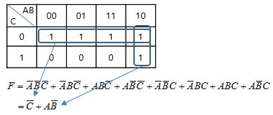

영상: [CSA2021 컴퓨터시스템구조](https://www.youtube.com/playlist?list=PLc8fQ-m7b1hCHTT7VH2oo0Ng7Et096dYc)

## 강의 소개
- 프로그래밍, 컴퓨터구조, 운영체제 : CS의 핵심과목, 세 과목간에 연관/공통되는 부분이 많음

## [제 1장 Part-1](https://www.youtube.com/watch?v=SG89LOgT7Vc&list=PLc8fQ-m7b1hCHTT7VH2oo0Ng7Et096dYc&index=2)

### 디지털 컴퓨터(Digitial Computer)

- 정의 
  - 이진 시스템을 사용하여 계산을 수행하는 디지털 시스템
  - 비트의 그룹을 사용하여 숫자, 문자 및 기타 정보를 표시하거나 처리
- 컴퓨터 하드웨어
  - CPU - 중앙처리장치. 컴퓨터 그 자체로 정의. 산술 논리 처리와 데이터의 저장, 제어 기능 수행
  - 주변장치 - 메모리(RAM/ROM), 저장 장치(Storage), 입출력 장치(IO devices)

- 컴퓨터 소프트웨어
  - 운영체제
    - OS - Operating System
  - 시스템프로그램
    - 유틸리티, 데이터베이스, Editor
    - OS에 포함되거나 연결되어 시스템 운영을 보조
  - 응용프로그램

### 논리 게이트(Logic Gates)
- 이진 정보의 표시
  - 0과 1의 전압 신호
  - (0V - 5V) 시스템
  - (0.5V - 3V) 시스템

- 논리 게이트
  - 기본 게이트
  - 진리표로 동작 정의

### [부울 대수(Boolean Algebra)](/이산-수학/명제,추론,귀납,부울대수/부울-대수.md)

- 이진 변수와 논리 동작을 취급하는 대수
- 기본 대수 동작 : AND, OR, NOT
- 부울 대수의 예
  - F = x + y'z
- 부울 대수의 사용 이유
  - 변수 사이의 진리표 관계를 대수적으로 표시
  - 논리도의 입출력 관계를 대수 형식으로 표시
  - 같은 기능을 가진 더 간단한 회로 발견
- 부울 대수의 기본 관계
  - 항등원
  - 역원
  - 교환법칙
  - 결합법칙
  - 드모르강의법칙
- 부울 대수의 간략화와 등가 회로
  - F = ABC + ABC' + A'C = AB(C+C') + A'C = AB + A'C
- 부울 대수의 보수
  - F = AB + C'D' + B'D
  - F' = (A' + B')(C + D)(B + D')

### 맵의 간소화 (Karnaugh Map)
- [4강 동치 관계](/이산-수학/이산수학-기초/동치-관계.md)
- 맵 방식의 부울 수식 간소화
  - 부울 함수를 visual diagram을 통하여 간소화
  - Karnaugh map, veitch diagram
  - Minterm, Maxterm을 이용한 간소화

- 논리합의 논리곱
  - 1항의 간소화
  - 0항의 간소화

- 무정의 조건(Don't Care Condition)
  - 사용하지 않는 항을 활용하여 간소화
  - 0으로 간주해도 되고 1로 간주해도 됨

## [제 1장 Part-2](https://www.youtube.com/watch?v=gn5z3Un_qqM&list=PLc8fQ-m7b1hCHTT7VH2oo0Ng7Et096dYc&index=3)

### 조합회로 (Combinational Circuit)
- 정의

  - 입력과 출력을 가진 논리 게이트의 집합
  - 출력의 값은 입력의 0, 1의 조합에 의하여 결정되는 함수의 결과로 표시
  - n개의 입력 조합이 있을 경우 가능한 입력 조합 : 2n가지

- 조합 회로의 설계 절차

  1. 해결할 문제의 제시
  2. 입력과 출력의 변수에 문자 기호 부여
  3. 입력-출력 관계를 정의하는 진리표 도출
  4. 각 출력에 대한 간소화된 부울 함수 도출
  5. 부울 함수에 대한 논리도 작성
  6. 논리도를 바탕으로 회로 구현

- 반가산기(Half adder)

  - 2개의 비트값을 산술적으로 가산

    S = x'y + xy' = x ⊕ y

    C = xy

- 전가산기(Full adder)

  - 캐리값을 포함하여 3비트 가산

    S = x ⊕ y ⊕ z

    C = xy + (x ⊕ y)z

### 플립플롭 (Flip-Flop)
- 플립플롭의 정의
  - 1비트의 디지털 정보를 저장하는 이진 셀(디지털 메모리)
  - 동기식 순차회로의 기본적인 요소로 사용, 조합회로와 함께 순차회로를 구성
  - 입력의 상태가 변화를 일으키기 전까지는 이전의 출력 상태를 그대로 유지(클럭이 들어오면 상태 변화)

- 플립플롭의 종류
  - SR-플립플롭
  - D-플립플롭
  - JK-플립플롭
  - T-플립플롭

- 모서리-변이형 플립플롭(Edge-triggered FF)
  - 입력값의 변화 모서리에서만 동작
    - Upward triggered FF
      - 입력값이 상향일 경우에만 동작(0 ⇒ 1)
    - Downward triggered FF
      - 입력값이 하향일 경우에만 동작(1 ⇒ 0)
  - 올바른 동작을 위해서는 최소의 신호 유지 시간 필요
    - Setup time
      - 출력 변화를 위하여 입력이 유지되어야 하는 최소 시간
    - Hold time
      - 출력 유지를 위하여 입력이 바뀌지 않아야 하는 최소 시간

### 순차회로 (Sequential Circuit)
- 정의
  - 플립플롭과 게이트(또는 조합회로)를 서로 연결한 회로
  - 클럭펄스에 의하여 동기화된 입력 순차에 의하여 제어
  - 출력은 외부 입력과 플립플롭의 현 상태의 함수로 표시
- 플립플롭의 입력시
  - FF의 입력을 만들어내는 조합 회로 부분
  - 부울 수식에 의하여 표현
  - 상태표(State Table)
  - 상태도(State Diagram)
- 순차회로의 설계 예
  - 2비트 2진카운터의 설계
    1. 상태표, 상태도 작성
    2. 순차회로 여기표 작성
    3. 플립플롭의 선택과 입력식 도출
    4. 회로도 구현